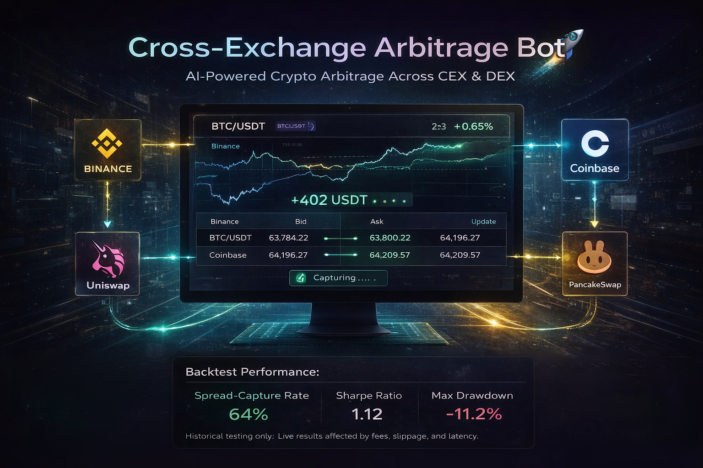

# Cross-Exchange Arbitrage Bot 🚀

**AI-powered cross-exchange crypto arbitrage.** Detect price discrepancies across CEX/DEX, run automated or manual execution, and monitor spreads in real time.

[](LICENSE) [](https://github.com/asonglin/cross-exchange-arbitrage-bot/stargazers)

---



## Why cross-exchange arbitrage

Prices for the same asset often **differ across venues** due to latency, liquidity, and flow. This bot scans multiple exchanges (and oracles), finds exploitable spreads, and supports execution so you can capture those gaps before they close.

---

## Who this is for

- **Crypto trading firms** — Multi-venue arbitrage and execution
- **Quant teams** — Spread and latency research
- **Exchanges** — Price and liquidity monitoring
- **Developers** — Bots and API integrations

---

## Commercial use

Need **custom arbitrage bots**, **multi-exchange execution**, or **oracle/API integrations**? Get in touch:

- **Telegram** — [@jjcunningham](https://t.me/jjcunningham)
- **Email** — jj.cunningham1129@gmail.com
- **GitHub** — [Open an issue](https://github.com/asonglin/cross-exchange-arbitrage-bot/issues)

---

## Backtest performance

Historical backtest only; not live trading.

| Parameter | Value |
|-----------|--------|
| Period | Q2 2024 – Q1 2025 |
| Markets | Multi-exchange spot |
| Execution | Simulated |

| Metric | Result |
|--------|--------|
| Spread-capture rate | 64% |
| Sharpe ratio | 1.12 |
| Max drawdown | −11.2% |

*Fees, slippage, and latency will affect live results.*

---

## Strategy concept

**Price diverges across venues before it mean-reverts.** This bot focuses on **detecting and acting on spread opportunities** across connected exchanges and oracles (e.g. Binance, Coinbase, DEX oracles) so you can run statistical or pure arbitrage with clear execution logic.

---

## Architecture

```
Exchange / oracle feeds (Binance, Coinbase, 1inch, etc.)
        ↓
Spread & opportunity detector
        ↓
Execution layer (Backend) / optional contracts
        ↓
Frontend (monitoring, controls)
```

---

## Quick start

```bash
git clone https://github.com/asonglin/cross-exchange-arbitrage-bot.git
cd cross-exchange-arbitrage-bot
```

**Backend (Python):** `cd Backend && pip install -r requirements.txt` — configure oracles and run `main.py`.  
**Frontend:** `cd Frontend && npm install && npm run dev` for the dashboard.  
**Contracts:** See `Contracts/` for deployment and scripts.

---

## Project layout

```
cross-exchange-arbitrage-bot/
├── Backend/          # Python oracles (Binance, Coinbase, 1inch, PancakeSwap, Jupiter), main.py
├── Frontend/         # Vite app, monitoring UI
├── Contracts/        # Solidity (e.g. ArbixVault), scripts
└── run.ps1           # run helper
```

---

## Related projects

- [Crypto Arbitrage AI](https://github.com/asonglin/crypto-arbitrage-ai) — ML-based arbitrage signals
- [Crypto Liquidity Hunting Bot](https://github.com/asonglin/crypto-liquidity-hunting-bot)
- [Funding Rate Arbitrage Bot](https://github.com/asonglin/funding-rate-arbitrage-bot)
- [Whale Tracking AI](https://github.com/asonglin/whale-tracking-crypto-bot)
- [Market Manipulation Detection Bot](https://github.com/asonglin/market-manipulation-detection-bot)
- [Crypto Signal Engine](https://github.com/asonglin/crypto-signal-engine-ai)

---

**License:** MIT © 2026
